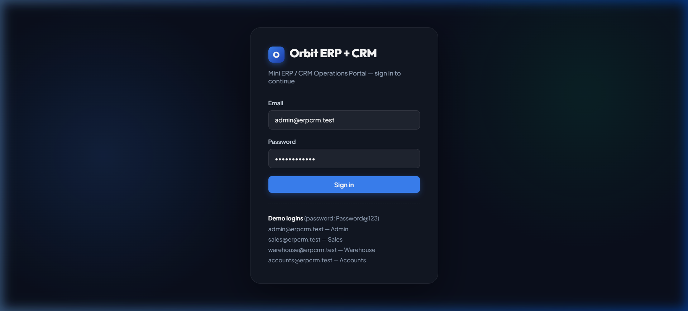
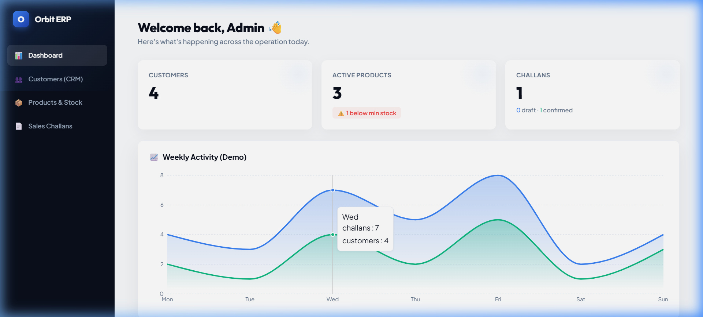
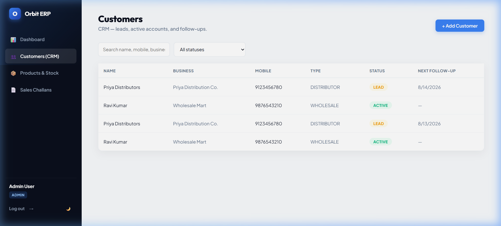
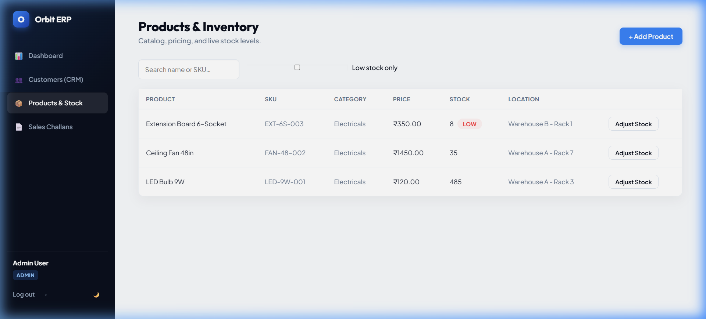
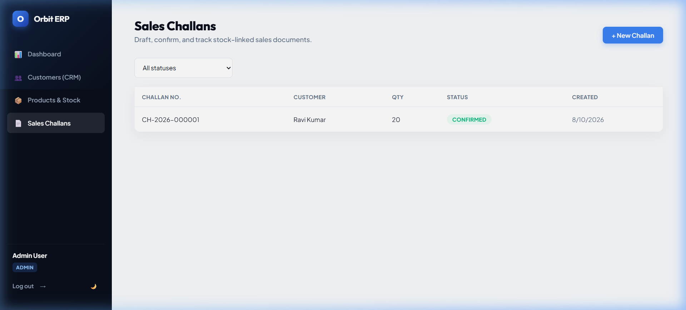
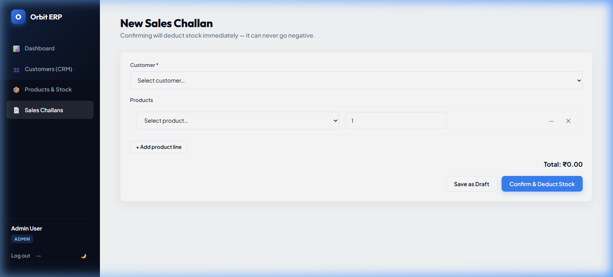
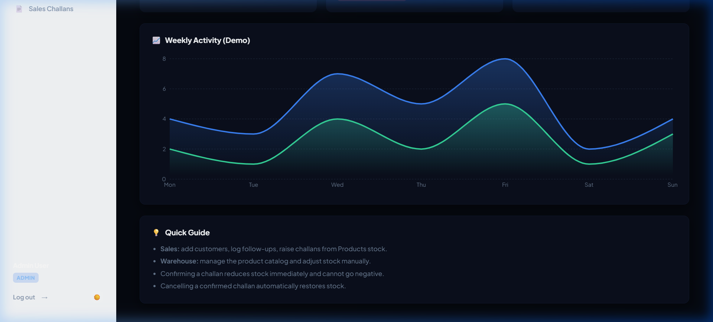
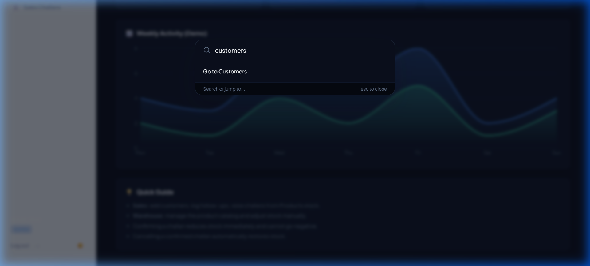

# Orbit ERP + CRM — Mini ERP/CRM Operations Portal

A wholesale/distribution operations portal covering customer CRM, product & inventory
management, and a sales challan flow with real stock-deduction business logic.

Built for the Full Stack Developer case study.

## Tech Stack

| Layer      | Choice                                                              |
|------------|----------------------------------------------------------------------|
| Backend    | Node.js, TypeScript, Express.js, Prisma ORM, PostgreSQL, JWT, Zod     |
| Frontend   | React 18, TypeScript, Vite, React Router, Axios                      |
| Deployment | Docker Compose (local) / Render + Vercel + Neon (cloud, free tier)   |

## Architecture

```
erp-crm/
├── backend/          Express + TypeScript REST API
│   ├── prisma/        schema.prisma (DB design) + seed.ts (demo data)
│   └── src/
│       ├── routes/       one file per resource, RBAC applied per-route
│       ├── controllers/  request handling + business logic
│       ├── middleware/   auth (JWT), RBAC, zod validation, error handler
│       ├── utils/        JWT/password helpers, challan number generator
│       └── app.ts / server.ts
├── frontend/         React SPA (Vite)
│   └── src/
│       ├── api/           axios instance with auth interceptor
│       ├── context/       AuthContext (login/logout/session)
│       ├── components/    shared layout (role-aware sidebar)
│       └── pages/         Login, Dashboard, Customers, Products, Challans
├── docker-compose.yml   one-command local stack (Postgres + API + SPA)
└── postman_collection.json
```

**Request flow:** React SPA → Axios (attaches JWT) → Express routes → `authenticate`
middleware (verifies JWT) → `authorize(...roles)` middleware (RBAC) → Zod validation →
controller (business logic, wrapped in a Prisma `$transaction` where stock is touched) →
PostgreSQL via Prisma.

**Key design decisions:**
- **Product snapshot on challan items.** Each `ChallanItem` stores `productNameSnap`,
  `productSkuSnap`, `unitPriceSnap` frozen at creation time — not just a `productId` FK.
  If a product is later renamed or repriced, historical challans stay accurate.
- **Stock changes are transactional.** Confirming a challan, cancelling a confirmed
  challan, and manual stock adjustments all run inside `prisma.$transaction`, so a
  partial stock update can never be left half-applied. Insufficient stock throws before
  any write happens, and the DB layer never lets `currentStock` go below 0.
- **Every stock change is logged.** `StockMovement` records IN/OUT, quantity, reason,
  who did it, and (for challan-driven movements) which challan caused it — a full audit
  trail rather than just the running total on `Product`.
- **Role-based access control** is enforced server-side via an `authorize()` middleware
  on each route, not just hidden in the UI (the UI also hides actions the role can't
  perform, for usability).

## Roles

| Role       | Can view | Can manage customers/follow-ups | Can manage products/stock | Can create/confirm/cancel challans |
|------------|:--------:|:--------------------------------:|:--------------------------:|:------------------------------------:|
| Admin      | ✅ | ✅ | ✅ | ✅ |
| Sales      | ✅ | ✅ | ❌ | ✅ |
| Warehouse  | ✅ | ❌ | ✅ | Cancel only |
| Accounts   | ✅ | ❌ | ❌ | ❌ |

## Demo Login Credentials

All roles share the password **`Password@123`** (seeded by `npm run seed`):

| Role      | Email                    |
|-----------|---------------------------|
| Admin     | admin@erpcrm.test         |
| Sales     | sales@erpcrm.test         |
| Warehouse | warehouse@erpcrm.test     |
| Accounts  | accounts@erpcrm.test      |

---

## Running Locally

### Option A — Docker Compose (recommended, one command)

Requires Docker + Docker Compose installed. No local Node or Postgres needed.

```bash
docker compose up --build
```

This starts Postgres, runs the backend (which auto-applies Prisma migrations on boot),
and serves the frontend via nginx.

- Frontend: http://localhost:5173
- Backend API: http://localhost:4000/api
- Backend health check: http://localhost:4000/api/health

**Seed demo data** (run once, after containers are up):
```bash
docker compose exec backend npm run seed
```

### Option B — Run backend and frontend manually

**Prerequisites:** Node.js 20+, a PostgreSQL 14+ database (local install, or a free
hosted instance from Neon / Supabase / Render).

**1. Backend**
```bash
cd backend
cp .env.example .env
# edit .env: set DATABASE_URL to your Postgres connection string, and JWT_SECRET to any long random string
npm install
npx prisma migrate dev --name init   # creates tables
npm run seed                         # creates demo users + sample data
npm run dev                          # starts on http://localhost:4000
```

**2. Frontend** (in a separate terminal)
```bash
cd frontend
cp .env.example .env
# edit .env if your backend isn't on localhost:4000
npm install
npm run dev                          # starts on http://localhost:5173
```

Open http://localhost:5173 and log in with any demo credential above.

---

## Environment Variables

**Backend (`backend/.env`)**

| Variable         | Description                                              |
|------------------|------------------------------------------------------------|
| `PORT`           | API port (default 4000)                                   |
| `DATABASE_URL`   | PostgreSQL connection string                               |
| `JWT_SECRET`     | Secret used to sign JWTs — use a long random string        |
| `JWT_EXPIRES_IN` | Token lifetime, e.g. `8h`                                  |
| `CORS_ORIGIN`    | Comma-separated list of allowed frontend origins            |

**Frontend (`frontend/.env`)**

| Variable        | Description                          |
|-----------------|----------------------------------------|
| `VITE_API_URL`  | Base URL of the backend API, e.g. `http://localhost:4000/api` |

Secrets are never committed — only `.env.example` files are in the repo. Each `.env` is
git-ignored.

---

## Deploying (free-tier, no AWS cost required)

1. **Database** — create a free Postgres instance on [Neon](https://neon.tech) or
   [Supabase](https://supabase.com). Copy the connection string into `DATABASE_URL`.
2. **Backend** — deploy `backend/` to [Render](https://render.com) or
   [Railway](https://railway.app) as a Node web service:
   - Build command: `npm install && npx prisma generate && npm run build`
   - Start command: `npx prisma migrate deploy && npm start`
   - Set `DATABASE_URL`, `JWT_SECRET`, `JWT_EXPIRES_IN`, `CORS_ORIGIN` (your frontend URL) as env vars.
   - After first deploy, run the seed script once via the platform's shell/console: `npm run seed`.
3. **Frontend** — deploy `frontend/` to [Vercel](https://vercel.com) or
   [Netlify](https://netlify.com):
   - Build command: `npm run build`, output directory: `dist`
   - Set `VITE_API_URL` to your deployed backend's `/api` URL.
4. Update the backend's `CORS_ORIGIN` to your live frontend URL and redeploy.

**AWS (bonus, optional):** the same containers in `docker-compose.yml` can run on an EC2
instance or behind an ALB, with RDS Postgres in place of the local `db` service and S3
for product image uploads (see Known Limitations).

---

## API Overview

Base path: `/api`. All routes except `/auth/login` and `/health` require
`Authorization: Bearer <token>`.

| Method | Route                              | Roles                          | Notes |
|--------|-------------------------------------|----------------------------------|-------|
| POST   | `/auth/login`                       | public                          | returns JWT + user |
| GET    | `/auth/me`                          | any authenticated                | |
| GET    | `/customers`                        | any                              | `?search=&status=&type=&page=&limit=` |
| POST   | `/customers`                        | Admin, Sales                     | |
| GET    | `/customers/:id`                    | any                              | includes follow-ups + recent challans |
| PUT    | `/customers/:id`                    | Admin, Sales                     | |
| POST   | `/customers/:id/follow-ups`         | Admin, Sales                     | |
| GET    | `/products`                         | any                              | `?search=&category=&lowStock=true&page=&limit=` |
| POST   | `/products`                         | Admin, Warehouse                 | |
| GET    | `/products/:id`                     | any                              | includes stock movement history |
| PUT    | `/products/:id`                     | Admin, Warehouse                 | |
| POST   | `/products/:id/stock-movements`     | Admin, Warehouse                 | manual IN/OUT, rejects if it would go negative |
| GET    | `/challans`                         | any                              | `?status=&customerId=&page=&limit=` |
| POST   | `/challans`                         | Admin, Sales                     | create as `DRAFT` or `CONFIRMED` |
| GET    | `/challans/:id`                     | any                              | |
| PATCH  | `/challans/:id/confirm`             | Admin, Sales                     | deducts stock, rejects if insufficient |
| PATCH  | `/challans/:id/cancel`              | Admin, Sales, Warehouse          | restores stock if it had been confirmed |
| GET    | `/challans/:id/invoice`             | any                              | bonus: streams a PDF invoice |

Full request/response examples: import `postman_collection.json` into Postman. Run
**Login (Admin)** first — the token is captured automatically into `{{token}}` for every
other request in the collection.

---

## Assumptions

- "AWS deployment preferred" is treated as a bonus per the brief's own "AWS Deployment
  Expectations" section — this submission is documented for free-tier hosting
  (Render/Vercel/Neon) with Docker Compose as the primary local/reviewable path.
- One challan can only be edited (line items changed) while in `DRAFT`; once
  `CONFIRMED` it is immutable except for cancellation, matching how physical challans
  work in a warehouse.
- Stock movements from challans are logged as system-generated (`reason` references the
  challan number) rather than requiring a duplicate manual entry.
- GST number and email are optional on a customer since not every retail walk-in
  customer will have one.
- A single flat role set (Admin/Sales/Warehouse/Accounts) is used rather than granular
  permissions, per the brief's "Simple JWT-based authentication is acceptable."

## Known Limitations / Not Implemented

- Purchase orders are out of scope for this submission — the assignment's core modules
  (Auth/Roles, Customer CRM, Product/Inventory, Sales Challan) were prioritized given the
  48-hour window; stock is currently only increased via manual "Stock IN" adjustments.
- No automated test suite (unit/integration) — manual verification via the Postman
  collection and the UI is documented instead.
- Product image upload to S3 (bonus) is not implemented.
- No CI/CD pipeline (bonus) is configured; deployment is manual per the steps above.
- The frontend does not paginate customer/product tables in the UI yet (the API supports
  `page`/`limit` and pagination metadata is returned, but the table always requests the
  first page up to 100 rows).

## Screen Recording & Demo

> A full walkthrough of the live application was recorded demonstrating all core features.

### 📹 Demo Video


### 📸 Screenshots

| Login Page | Dashboard |
|---|---|
|  |  |

| Customers (CRM) | Products & Inventory |
|---|---|
|  |  |

| Sales Challans | New Challan Form |
|---|---|
|  |  |

| Dark Mode | Command Palette (Ctrl+K) |
|---|---|
|  |  |

### Features Demonstrated in the Recording

1. **Login** — Dark glassmorphic login screen
2. **Dashboard** — Stat cards (Customers, Products, Challans) + animated area chart
3. **Customers (CRM)** — Staggered table animation, customer list
4. **Add Customer** — Modal form with validation (Demo Client / Demo Corp)
5. **Products & Inventory** — SKU, pricing, stock levels, LOW STOCK badges
6. **Sales Challans** — DRAFT and CONFIRMED status display
7. **New Challan Form** — Customer selection + product line items
8. **Dark Mode** — Smooth animated theme toggle (🌙 in sidebar)
9. **Command Palette** — Press `Ctrl+K` for instant navigation search
10. **Logout** — Redirects cleanly back to the login screen
